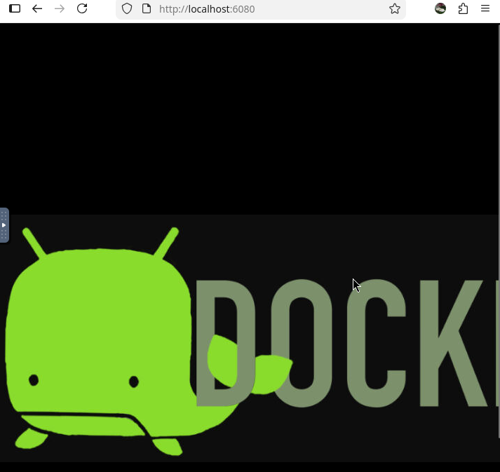

# Running android

Command line run

```bash
docker run -d -p 6080:6080 -e EMULATOR_DEVICE="Samsung Galaxy S10" -e WEB_VNC=true --device /dev/kvm --name android-container budtmo/docker-android:emulator_11.0
```

```bash
podman run -d -p 6080:6080 -e EMULATOR_DEVICE="Samsung Galaxy S10" -e WEB_VNC=true --device /dev/kvm --name android-container budtmo/docker-android:emulator_11.0
```

